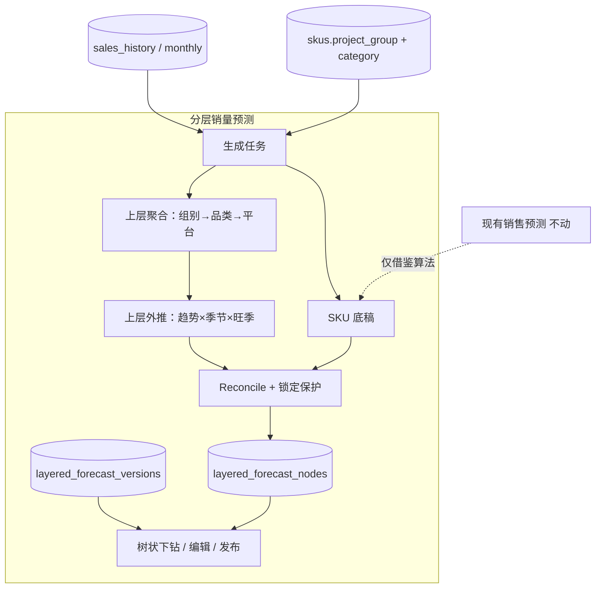

# 分层销量预测（独立模块）设计

> **状态**：已实现（一期代码已落地；部署需跑 0074 迁移）  
> **日期**：2026-08-11  
> **目标**：在现有「销售预测」之外新增独立模块，按 **组别 → 品类 → 平台 → SKU** 自上而下生成月销量预测：先定总量/趋势/品类季节/旺季，再算 SKU 底稿并 reconcile；支持上层与 SKU 编辑及锁定。一期不接补货与准确率，不写 `sales_forecast_*`。

---

## 1. 背景与决策

现有销售预测默认 `allcat_v41`，以 SKU 为中心；品类季节表主要服务 legacy；仅 C 类长尾有池拆分。业务需要真正的自上而下加总一致，且改造不宜直接改主预测链。

| 决策项 | 结论 |
|--------|------|
| 成功标准 | **加总一致 + 因子统一**：上层总量与季节/旺季驱动，SKU reconcile 后 Σ 子 = 父 |
| 与现预测关系 | **完全独立模块**：自有版本/表/发布；现有预测原样保留 |
| 层级 | **组别 → 品类 → 平台 → SKU**；站点一期固定 `ALL` |
| 组别口径 | **`skus.project_group`**；空 → `(未分组)` |
| SKU 层算法 | **先 SKU 底稿，再按上层总量比例 reconcile** |
| 人工调整 | 上层可改并 cascade；SKU 可改；可锁定，锁定行不参与下次 reconcile/cascade |
| 补货 / 准确率 | **一期不接** |
| 销售分析看板 | 不共用 Cube 表；可复用维度/趋势季节纯函数思路 |

**推荐实现路径**：影子分层模块（方案 1）——新表新 API 新页面；SKU 底稿可借鉴现预测算法思想，但不调用旧 `generate-baseline` 写库。

---

## 2. 架构与数据流



**生成顺序（硬约束）**

1. 历史截断至 `startMonth` 之前（严格回测，无未来泄漏）。
2. 聚合并外推组别 → 品类 → 平台月总量，子层之和等于父层。
3. 计算 SKU×平台×月底稿 `draft_qty`（站=`ALL`；平台展开与现网 V41 五平台一致）。
4. 在未锁定 SKU 上按底稿比例将平台层月总量分配为 `qty`；锁定 SKU 保持手改值，并从可分配池扣除。
5. 落库 `draft`；发布仅变更本模块版本状态。

**一期刻意不做**

- 写入或覆盖 `sales_forecast_*`
- 补货、准确率、Dify 单 SKU、评审 issue 表
- 与销售分析 Cube 共用快照表
- 子层改完后自动向上回写父层（避免循环；用显式按钮处理差额）

---

## 3. 数据模型

前缀：`layered_forecast_*`。菜单文案：「分层销量预测」。菜单 code：`data.layered_forecast`（与 `data.forecast` 并列）。

### 3.1 `layered_forecast_versions`

| 列 | 类型 | 说明 |
|----|------|------|
| `id` | uuid PK | |
| `version_no` | varchar | 唯一 |
| `version_name` | varchar | |
| `status` | enum | 独立 enum：`draft` \| `published` \| `archived`（不复用旧 enum 类型名以免耦合） |
| `start_month` | varchar(7) | 地平线首月 `YYYY-MM` |
| `horizon_months` | integer | 默认 12 |
| `station` | varchar | 一期固定 `ALL` |
| `algo_meta` | jsonb | 生成参数与规则摘要：平台列表、季节/旺季摘要、无历史 SKU 规则等 |
| `created_by` / `published_by` | uuid 可空 | |
| `published_at` / `created_at` / `updated_at` | timestamptz | |

### 3.2 `layered_forecast_nodes`

一行 = 某一层级节点在某月的预测。

| 列 | 类型 | 说明 |
|----|------|------|
| `id` | uuid PK | |
| `version_id` | uuid FK | |
| `level` | varchar/enum | `project_group` \| `category` \| `platform` \| `sku` |
| `project_group` | varchar | 来自 `skus.project_group`；空用 `(未分组)` |
| `category` | varchar | **品类叶子**（路径最后一段；空 → `(未分类)`）；写入 `algo_meta.categoryRule=leaf` |
| `platform` | varchar | 平台 code；组别/品类汇总行用 `ALL` |
| `sku_id` | uuid 可空 | 仅 `level=sku` |
| `period` | varchar(7) | `YYYY-MM` |
| `qty` | numeric | **生效月销量**（权威） |
| `system_qty` | numeric | 最近一次系统分配结果 |
| `draft_qty` | numeric 可空 | SKU 底稿；上层可空 |
| `locked` | boolean | 默认 false；仅 SKU 有业务含义 |
| `seasonality_factor` | numeric 可空 | 当月使用因子 |
| `trend_factor` | numeric 可空 | |
| `peak_month` | integer 可空 | 所属品类旺季峰月 1–12 |
| `manual_edited` | boolean | 用户改过 `qty` 后为 true |

唯一键：`(version_id, level, project_group, category, platform, sku_id, period)`；空维用约定占位符（`sku_id` 上层用零 UUID 或 DB null + partial unique，实现时选一种并在迁移中固定）。

**加总不变量**

- 同月：Σ(平台 under 品类，`platform≠ALL`) = 品类 `ALL` 行 `qty`（若存品类 ALL）
- Σ(品类 under 组别) = 组别 `qty`
- Σ(未锁定 SKU `qty` + 锁定 SKU `qty`) 应等于平台节点 `qty`；cascade/reconcile 后未锁定侧按池分配保证；若用户只改 SKU 未点按钮，允许短暂差额并由 UI 警告

### 3.3 权限

读 / 生成 / 编辑 / 发布与 `data.forecast` 同级角色授权即可。

---

## 4. 生成算法与编辑规则

### 4.1 输入

- 销量：`sales_history`（及现有月汇总若可用），平台经现有别名归一
- 平台展开：`AMAZON | WALMART | TEMU | TIKTOK | UNKNOWN`（与 V41 一致）
- `startMonth`：合法范围对齐现预测回测（当前月往前最多 6 个月）；缺省当前月
- 可选过滤：组别 / 品类（缩小生成范围）

### 4.2 上层（组别 → 品类 → 平台）

对每个节点月序列：

1. 趋势：线性拟合；短序列退化为均值或朴素
2. 季节：优先品类叶子历史估月因子，不足回退组别；峰月 = 因子最大月
3. 外推：趋势基线 × 季节因子；综合因子保守裁剪约 `[0.7, 1.3]`（与现网保守策略同量级）
4. 自上而下约束：先定父层月总量，子节点独立外推后再按比例缩放，使子和 = 父

写入：`system_qty = qty`；附带因子与 `peak_month`。

### 4.3 SKU 底稿

- 每 SKU×平台×月：`draft_qty`（近期销量外推 × 品类季节思路的简化实现；具体公式在 implementation plan 中落到可测纯函数）
- 无历史：`draft_qty = 0`
- **不**调用旧 `generateBaselineForecastVersion` / **不**写 `sales_forecast_monthly`

### 4.4 Reconcile（平台 → SKU）

对每个品类×平台×月：

```
parent = 平台节点.qty
locked_sum = Σ locked SKU.qty
pool = max(parent - locked_sum, 0)
未锁定：按 draft_qty 占比分配 pool → qty，并更新 system_qty
若未锁定 draft 全 0：按近 90 天销量份额；仍全 0 则均分到未锁定 SKU（写入 algo_meta.zeroDraftRule）
```

### 4.5 人工编辑

| 操作 | 行为 |
|------|------|
| 改组别/品类/平台某月 `qty` | `manual_edited=true`；向下 cascade：子层按原 `qty` 或 `draft_qty` 份额重缩放；锁定 SKU 不动并从池中扣除 |
| 改 SKU `qty` | 只改该行；`manual_edited=true`；不自动改父层 |
| 锁定 / 解锁 | `locked`；解锁后参与下次 cascade/reconcile |
| 「按父层 reconcile」 | 重跑 §4.4 |
| 「按 SKU 重设父层」 | 父层 `qty = Σ 子 qty`，再视需要向上滚一层（按钮一次处理当前选中父节点） |

### 4.6 发布

- 校验：无负销量；可选 **差额为 0** 才允许发布（一期默认启用）
- `draft → published`；同站可只保留一份 published 或允许多份（一期允许多份 published，补货未接故无冲突）
- 不写补货、不写旧预测表

---

## 5. API

前缀：`/api/layered-forecasts`

| 方法 | 路径 | 作用 |
|------|------|------|
| `POST` | `/generate` | 新建 draft 并生成；body：`startMonth?`、`horizonMonths?`、过滤条件、`background?` |
| `GET` | `/versions` | 列表 |
| `GET` | `/versions/:id` | 版本头 + `algo_meta` |
| `GET` | `/versions/:id/nodes` | 查询参数：`level`、`projectGroup`、`category`、`platform`、`period`、分页 |
| `PATCH` | `/versions/:id/nodes/:nodeId` | 改 `qty`；query/body `cascade?: boolean` |
| `POST` | `/versions/:id/nodes/:nodeId/lock` | `{ locked: boolean }` |
| `POST` | `/versions/:id/reconcile` | `{ mode: 'from_parent' \| 'reset_parent_from_children', nodeId }` |
| `POST` | `/versions/:id/publish` | 发布 |
| `GET` | `/tasks/:taskId` | 后台生成进度 |

---

## 6. 页面

| 路由 | 内容 |
|------|------|
| `/data/layered-forecast` | 版本列表；生成对话框（开始月、月数、可选过滤） |
| `/data/layered-forecast/:versionId` | 详情：面包屑下钻、月表、锁定、reconcile/重设父层、发布 |

UI 必须标明：**独立模块，不进补货；非原「销售预测」**。顶栏展示旺季峰月摘要与加总差额警告。

视觉与交互遵循现有 scm 后台（淘宝活力橙 / 现预测页密度），不做营销向 landing。

---

## 7. 测试与验收

### 7.1 测试

- 无锁定时各层加总一致
- 锁定 SKU 在 cascade 后 `qty` 不变；`pool = parent - locked_sum`
- `startMonth` 训练截断无泄漏
- 空 `project_group`、无历史 SKU、单平台有量
- 发布在存在差额时拒绝（默认策略）
- 集成：生成/发布后 `sales_forecast_monthly` / `sales_forecast_versions` 行数不因本模块增加

### 7.2 验收

- 独立菜单可进入；可生成、下钻、改上层与 SKU、锁定、两种 reconcile、发布
- 可见季节因子与旺季峰月
- 现有销售预测与补货无回归

---

## 8. 二期（本 spec 不实现）

- 对接补货 / 准确率
- 一键同步到旧销售预测草稿
- 与销售分析看板同屏对比
- 站点拆分（非 `ALL`）
- 评审 issue / Dify 接入

---

## 9. 关键现有代码（只读借鉴）

- `apps/web/server/lib/forecast-collaboration.ts` — 编排与季节解析思路
- `apps/web/server/lib/forecast-allcat-v41.ts` — 默认 SKU 算法参考
- `apps/web/server/lib/forecast-aggregate-pool.ts` — 池拆分参考
- `apps/web/server/lib/forecast-platform-scope.ts` / `forecast-station-scope.ts`
- `apps/web/src/lib/sales-analytics-forecast.ts` — 趋势×季节外推参考
- `apps/web/src/pages/SalesForecastListPage.tsx` — UI 密度参考

---

## 10. 开放实现细节（plan 阶段钉死，不阻碍本 spec）

以下已选定默认，implementation plan 中写成可测函数即可：

1. 上层子节点缩放：默认「子节点独立外推后按比例缩放到父总量」
2. `draft_qty` 具体公式：默认「近 90 天日均 × 月天数 × 品类月季节因子（裁剪后）」
3. 节点唯一键空 `sku_id`：默认 DB `NULL` + partial unique index（实现时按 Postgres 惯例）
