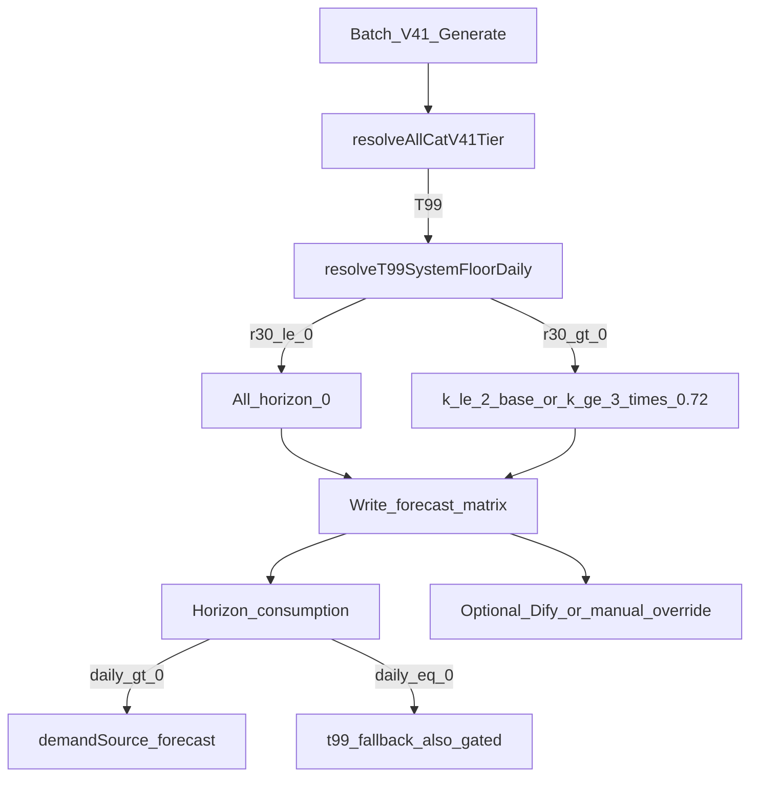

# T99 系统保守保底（批量出数，不依赖逐条 Dify）

> **状态**：已评审待实现  
> **日期**：2026-08-11  
> **目标**：T99 SKU 量大、单条 Dify 效率不足，但仍需备货；在 V4.1 批量生成路径为 T99 写入确定性保守预测，矩阵可见、补货可用；Dify/人工仅作可选覆盖。

---

## 1. 背景与决策

| 决策项 | 结论 |
|--------|------|
| 落点 | **方案 1**：V4.1 内嵌 T99 保底（`computeAllCatV41BoundedDaily` 不再对 T99 一律归零） |
| 水位公式 | `base = max(recent30, recent90) × 0.6`（与现有补货 `resolveT99ReplenishmentFallbackDaily` 对齐） |
| 断销闸门 | `recent30DailyAvg ≤ 0` → **全地平线 0**（优先于 max；即使 recent90 > 0） |
| 地平线形态 | 近端 `k ≤ 2` 用满额 `base`；`k ≥ 3` 再 × `0.72`（对齐 `V41_T4B_FLEX_DECAY_*`） |
| 分层标签 | 仍为 `T99`，不重分类到 T4B |
| 主 KPI | 仍 `excludedFromMainStats = true` |
| categoryPoolFloor | **不进预测矩阵**（仅补货池场景可继续用；预测水位不含 pool） |
| Dify | 默认不批量调用；商品页保留 AI/人工覆盖 |
| 历史版本 | 不强制重算；**新生成版本**生效 |

**动机**：T99 当前系统写 `0.00` + 依赖逐条 Dify，运营无法规模化备货；需要系统兼容运算。

---

## 2. 算法

对每个 `(sku, platform, horizonIndex k)`，在已判定 `tier === 'T99'` 后：

```text
if recent30DailyAvg <= 0:
  forecastDaily = 0
  t99FloorMode = zero_gate_recent30
else:
  base = max(recent30DailyAvg, recent90DailyAvg) * 0.6
  forecastDaily = (k >= 3) ? base * 0.72 : base
  t99FloorMode = recent_max06
```

约定：

- `recent30` / `recent90` 缺失或非有限值按 `0` 处理。
- 日均四舍五入口径与现有 `roundDaily` 一致。
- 不走 peer-platform 抬底（T99 保持保守、独立于跨平台抬底）。
- 不套用 T4A/T4B ghost 弱动销闸门以外的复杂上下界（本层仅「断销归零 + 近期 max 折扣 + 远月衰减」）。

与补货关系：

- 矩阵写入非 0 后，`resolveHorizonConsumptionDailyDetailed` 优先消费预测数（`demandSource = forecast`）。
- `t99_fallback` 仅在预测/生效仍为 0 时触发；**闸门同步**：`recent30 ≤ 0` 时 fallback 亦为 0（避免断销仍按 90 天备货）。

---

## 3. 服务端改动

### 3.1 统一水位

建议在 [`apps/web/server/lib/forecast-demand.ts`](apps/web/server/lib/forecast-demand.ts) 扩展或新增：

- `resolveT99SystemFloorDaily({ recent30, recent90, horizonIndex })`  
  - 含断销闸门 + `max × 0.6` + `k≥3` 衰减  
- `resolveT99ReplenishmentFallbackDaily`：对 `recent30 ≤ 0` 直接返回 0；有动销时保持 `max(r30,r90)×discount`，并可继续与 `categoryPoolFloor` 取 max（补货专用）

预测路径**不**把 `categoryPoolFloor` 写入矩阵。

### 3.2 V4.1 绑定

文件：[`apps/web/server/lib/forecast-allcat-v41.ts`](apps/web/server/lib/forecast-allcat-v41.ts)

- `computeAllCatV41BoundedDaily`：`tier === 'T99'` 分支改为调用 T99 系统保底，而非 `zeroBoundedDailyResult(false)`。
- `buildAllCatV41HorizonFactors` / 月结果 factors：增加审计字段  
  - `t99FloorDaily`  
  - `t99FloorMode`: `zero_gate_recent30` | `recent_max06`  
- `tierKpiTarget` / algorithm 文案：由「不预测」改为「保守保底」语义（常量可新增如 `T99_CONSERVATIVE_FLOOR`，避免误导）。
- `buildT99ReviewMessage`：说明系统已写保守保底或断销归零，不再写「系统不预测」。

常量（可与 T4B 复用或并列声明）：

| 常量 | 值 |
|------|-----|
| T99 折扣 | `0.6` |
| 远月衰减起点 | `k >= 3`（同 `V41_T4B_FLEX_DECAY_FROM_K`） |
| 远月衰减系数 | `0.72`（同 `V41_T4B_FLEX_DECAY_FACTOR`） |

### 3.3 单测

覆盖：

1. `r30=0, r90>0` → 全 k 为 0，`zero_gate_recent30`  
2. `r30>0`，`k≤2` → `max×0.6`  
3. `r30>0`，`k≥3` → `max×0.6×0.72`  
4. 补货 fallback：`r30=0` → 0；有动销 → 与折扣一致  
5. 主 KPI 排除逻辑不变（T99 仍不进主准确率）

---

## 4. 前端 / 文案

| 位置 | 调整 |
|------|------|
| [`forecast-labels.ts`](apps/web/src/lib/forecast-labels.ts) / profile 标签 | `T99 不预测` → `T99 保守保底` |
| [`ForecastStrategySection.tsx`](apps/web/src/components/ForecastStrategySection.tsx) | 策略说明改为：有近 30 天动销则系统写保守数；近 30=0 则全 0；不进主 KPI；Dify 可选覆盖 |
| 列表页 T99 说明 | 与上一致，去掉「系统写 0.00」绝对表述 |
| [`ForecastHorizonPanel.tsx`](apps/web/src/components/ForecastHorizonPanel.tsx) | 「待校准」**仅当** T99 且 `forecastDailyAvg === 0` 且无人工校准时显示 |
| 抽屉/列帮助 | 去掉「T99 层固定为 0.00」；改为「系统保守保底；断销为 0；锚定/季节可作诊断」 |

Dify DSL（`single-sku-forecast.yml`）本阶段**不改**；商品页 AI 覆盖链路保持现状。

---

## 5. 非范围

- 不批量调用 Dify / 不改 `sales-forecast-agent.yml`
- 不改 T1–T4B 分层门槛与主路径公式
- 不把 T99 纳入主准确率 KPI
- 不强制重跑已发布/历史预测版本
- 不做季节/同比混合进 T99 保底（保持简单近期水位）

---

## 6. 验收

| 场景 | 期望 |
|------|------|
| 近 30=0、近 90>0 | 新版本矩阵该 SKU 全地平线 0 |
| 近 30>0 | 近端 ≈ `max×0.6`；远月 ≈ 再 ×0.72 |
| 批量生成 | T99 有动销行矩阵可见非 0，无需点 AI |
| 主准确率统计 | T99 仍排除 |
| 商品页 | AI/人工仍可覆盖系统数 |
| 补货 | 有系统预测时用预测；断销闸门下 fallback 也为 0 |

---

## 7. 数据流（概念）


